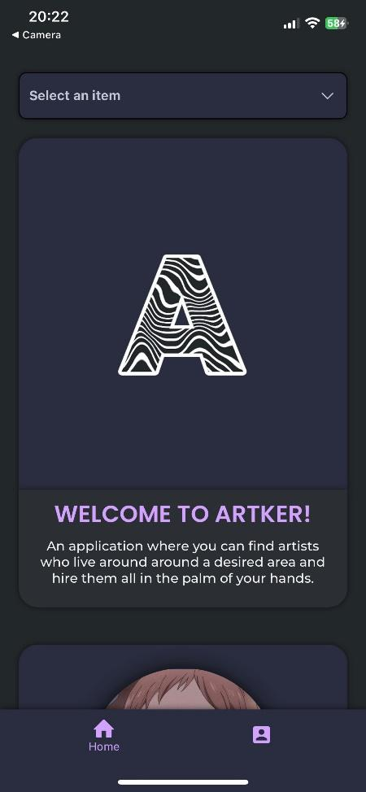

# 🎵 Artker – Music Freelancer Marketplace (Mobile App)

**Technologies:** `React`, `React Native`, `JavaScript`, `Firebase`

---

**Artker** is a cross-platform mobile application developed to connect **musicians** with **clients** looking for music-related services — think **Fiverr, but tailored for the music industry**.

Built using **React Native**, the app supports both iOS and Android platforms and provides an intuitive, smooth user experience powered by **Firebase’s real-time backend**.

---

## ✨ Key Features

- 🔐 **Secure Login & Registration** using Firebase Authentication  
- 💬 **Real-Time Messaging** system for clients and artists  
- 🧑‍🎤 **User Profiles** with genre tags, bios, and service offerings  
- 🔍 **Search & Filter System** to discover artists based on genres and skills  
- ☁️ **Cloud-Based Backend** for scalability, with Firebase Firestore and Realtime DB  

---

## 🧠 What I Learned

- 📱 Building **cross-platform UIs** with React Native
- 🔐 Implementing **user authentication** securely
- 🔄 Managing **real-time data syncing** across users
- ☁️ Integrating scalable **cloud services** using Firebase
- 🧩 Structuring large mobile apps with **modular and reusable components**

---

## 📦 Tech Stack

| Layer            | Technology                |
|------------------|---------------------------|
| 🧠 Frontend       | `React Native`, `JavaScript` |
| 🔗 Backend        | `Firebase Authentication`, `Firestore`, `Realtime DB` |
| 💬 Messaging      | Firebase-based live chat  |
| 📱 Platform       | Android & iOS             |
